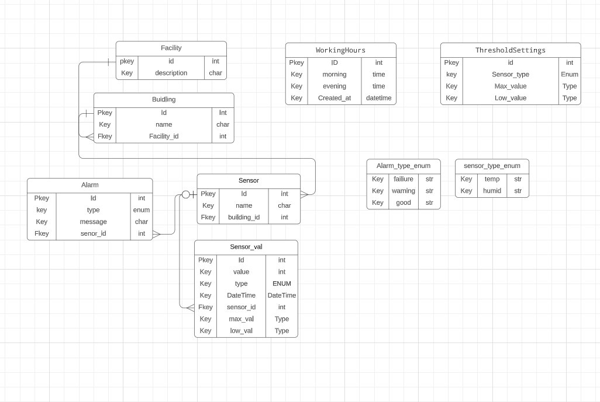
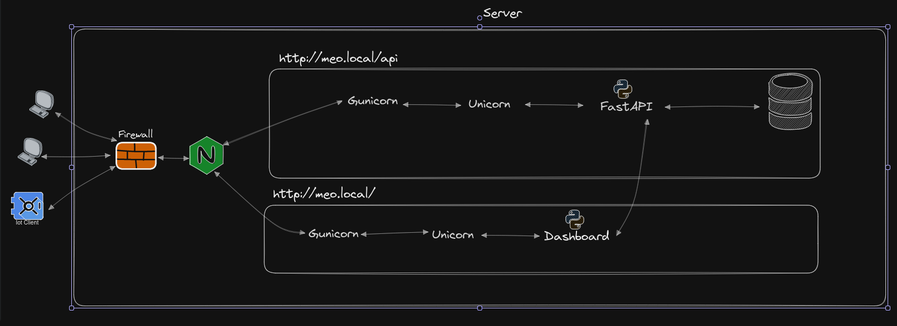
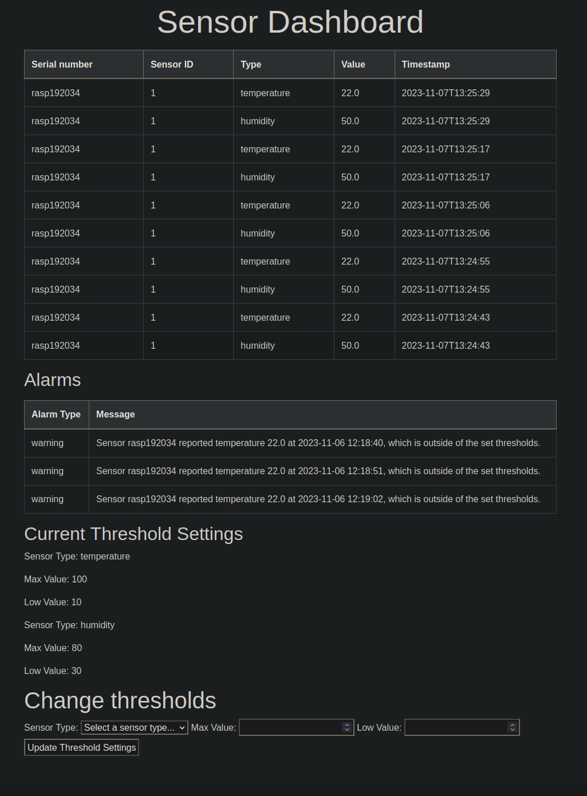

# Embedded Programming Report
###### case  2
Report stats: 
- Reading Time: 19 mins 


## Table of Contents

1. [Introduction](#introduction)
2. [Server Side](#server-side)
   - [Main API](#main-api)
     - [About the Server](#about-the-server)
     - [Main API and endpoints](#main-api-and-endpoints)
     - [How to Use It](#how-to-use-it-2)
     - [Tools and Frameworks](#tools-and-frameworks)
   - [Dashboard API and Website](#dashboard-api-and-website)
     - [About the Dashboard](#about-the-dashboard)
     - [How to Use It](#how-to-use-it-1)
     - [Tools and Frameworks](#tools-and-frameworks-1)
3. [Client Side](#client-side)
   - [Linux Based Client](#linux-based-client)
     - [About the Client](#about-the-client)
     - [How to Use It](#how-to-use-it-3)
     - [Tools and Frameworks](#tools-and-frameworks-3)
   - [Embedded Device](#embedded-device)
     - [About the Device](#about-the-device)
     - [How to Use It](#how-to-use-it-4)
     - [Tools and Frameworks](#tools-and-frameworks-4)
4. [Server Configuration](#server-configuration-1)
5. [Still missing](#still_missing)
6. [conclusion](#conclusion)
7. [Glossary](#glossary)

<a name="introduction"></a>

## Introduction

Environment Monitoring and Management System by Greenhouse A/S, is an integrated setup combining embedded devices, a centralized server, and seamless networking. It provides continuous monitoring of conditions like temperature and humidity, ensuring ideal plant growth. Sensor data can be analyzed via a website or by the system itself, it will push alarms if any anomalies occurs. This cohesive system ensures agricultural efficiency and proactive management of greenhouse environments.

-------------------------------------------------------------------------------------

## Architecture

- Service-Oriented Architecture: using source control design:  manyrepo instead of monorepo
  - [Server GitHub Repository](https://github.com/mart337i/fastapi-nginx-gunicorn)
  - [Dashboard](https://github.com/mart337i/dashboard_fastapi-nginx-gunicorn)
  - [Client GrovePi GitHub Repository](https://github.com/mart337i/embeded_device)
  - [Client M5GO GitHub Repository](https://github.com/mart337i/M5GO)
 

### ER diagram


### System Design diagram 

**Note:** The urls defined at `http://meo.local` and `http://meo.local/api/` are routes defined by Nginx, that passes tdp packages to the correct urls.

### Design principles
- KISS (Keep It Simple, Stupid): 
- DRY (Don't Repeat Yourself): 

-------------------------------------------------------------------------------------
<a name="server-side"></a>

## Server Side


<a name="about-the-server"></a>

#### About the Server

The server is running Raspberry Pi OS Lite which is a lightweight version of the Raspberry Pi operating system, based on Debian Linux.

 It is optimized for the Raspberry Pi hardware and is a command-line only interface, meaning no graphical desktop.


<a name="main-api-and-endpoints"></a>

### Main API and endpoints

The API facilitates greenhouse environment monitoring and management, handling sensor data for temperature and humidity, and allows for configuration changes and retrieval of current settings. It supports the creation of new facility, building, and sensor records, and offers a dashboard view for real-time data and alerts

***Endpoints***

<details closed>

#### Welcome Page

```http
GET /
```

Serves the HTML welcome page for the Greenhouse Temperature and Humidity API.

#### Setup

```http
POST /change_target_building/
Content-Type: application/json
  {
    "facility": {
      "id": 0,
      "beskrivelse": "string"
    },
    "building": {
      "id": 0,
      "name": "string",
      "facility_id": 0
    }
  }
```

#### Change Target Building

```http
POST /change_target_building/
Content-Type: application/json

{
  "building_id": [building_id]
}
```

Endpoint to change the target building to the specified ID.

#### Change Target Facility

```http
POST /change_target_facility/
Content-Type: application/json

{
  "facility_id": [facility_id]
}
```

Endpoint to change the target facility to the specified ID.

#### Change Target Sensor Name

```http
POST /change_target_name/
Content-Type: application/json

{
  "sensor_name": "[sensor_name]"
}
```

Endpoint to change the target sensor to the specified name.

#### Get Target Building

```http
GET /get_target_building/
```

Retrieves the currently targeted building.

#### Get Target Facility

```http
GET /get_target_facility/
```

Retrieves the currently targeted facility.

#### Get Target Sensor Name

```http
GET /get_target_name/
```

Retrieves the currently targeted sensor name.

#### Create Facility

```http
POST /facility/
Content-Type: application/json

{
  "facility": "[facility_object]"
}
```

Creates a new facility entry with the given details.

#### Create Building

```http
POST /building/
Content-Type: application/json

{
  "building": "[building_object]"
}
```

Creates a new building entry with the given details.

#### Create Sensor

```http
POST /create_sensor/
Content-Type: application/json

{
  "sensor": "[sensor_object]"
}
```

Creates a new sensor or returns an existing one based on the serial number.

#### Post Sensor Value

```http
POST /sensor_value/
Content-Type: application/json

{
  "sensor_value": "[sensor_value_object]"
}
```

Creates a new sensor value record.

#### Create Alarm

```http
POST /alarm/
Content-Type: application/json

{
  "alarm": "[alarm_object]"
}
```

Creates a new alarm based on the sensor data.

#### Get Sensor by Serial Number

```http
GET /get_sensor_by_serial/{serial_number}
```

Retrieves sensor details by its serial number.

#### Dashboard Data

```http
GET /dashboard/
```

Retrieves dashboard data, including sensor values and alarms.

#### Get Temperature Data by Sensor ID

```http
GET /get_temp_data/{sensor_id}
```

Fetches the latest temperature data for a given sensor ID.

#### Get Humidity Data by Sensor ID

```http
GET /get_humid_data/{sensor_id}
```

Fetches the latest humidity data for a given sensor ID.

#### Update Threshold Settings

```http
PUT /threshold-settings/
Content-Type: application/json

{
  "sensor_type": "[sensor_type]",
  "max_value": [max_value],
  "low_value": [low_value]
}
```

Updates the threshold settings for a given sensor type.

#### Get Threshold Settings

```http
GET /threshold-settings/
```

Retrieves the list of all threshold settings for sensors.

#### Get All Sensor Serial Numbers

```http
GET /get_all_sensor_serial_numbers
```

Retrieves all sensor serial numbers in the system.

```http
POST /set_working_hours/
Content-Type: application/json

{
  "morning_hour": [morning_hour],
  "morning_minute": [morning_minute],
  "evening_hour": [evening_hour],
  "evening_minute": [evening_minute]
}
```

Endpoint to create working hours configuration.


</details>

<a name="how-to-use-it-2"></a>

#### How to Use It

```bash 

Server commands

Nginx
commands
systemctl enable nginx.service
systemctl start nginx.service
systemctl status nginx.service
systemctl restart nginx.service

superviser
sudo supervisorctl reread
sudo supervisorctl update
sudo supervisorctl status fastapi-app
sudo supervisorctl restart fastapi-app

Gunicorn
Test socket
curl --unix-socket /home/sysadmin/code/fastapi-nginx-gunicorn/run/gunicorn.sock meo.local/<endpoint address>

```

<a name="tools-and-frameworks"></a>

#### Tools and Frameworks

- Tools

  - Nginx (TLDR: I used it mostly has a reverse proxy )

    - NGINX is a high‑performance, highly scalable web server and reverse proxy

      - Base Nginx config -> [Base Nginx config](#nginx_base_configuration)
      - Custom Nginx config -> [Custom Nginx config](#nginx_custom_configuration)


  - Gunicorn

    - Python Web Server Gateway Interface (WSGI)

      - My Config -> [Gunicorn](#gunicorn-configuration)

  - Uvicorn (TLDR: Webserver)
    - This is part of FASTapi python framework and works as an ASGI web server implementation for Python.
    
  - Mariadb (TLDR : Database)
  
  - Superviser (TLDR: SystemD but more encapsulated )

    - Supervisor is a client/server system that allows its users to monitor and control a number of processes on UNIX-like operating systems.
    - My Config -> [Supervisor](#supervisor_custom)

- Framework
  - fastapi:
    -  A modern, fast web framework for building APIs with Python based on standard Python type hints.
  - SQLAlchemy: 
    - A powerful SQL toolkit and Object-Relational Mapping (ORM) library for Python that allows for flexible database access and management.
  - SQLModel
    - SQLModel is, a thin layer on top of Pydantic and SQLAlchemy, that is designed to simplify interacting with SQL databases in FastAPI applications
  - uvicorn: 
    - An ASGI server implementation for Python, serving as a lightning-fast foundation for ASGI applications like those built with FastAPI.
  - logging: 
    - A standard Python library for implementing flexible event logging systems for applications and libraries.
  - mariadb: 
    - A Python library that facilitates connection to MariaDB databases, enabling operations like queries, updates, and schema changes.
  - mysqlclient: 
    - A fork of MySQL-python, it is a Python database connector for connecting to MySQL databases that provides compatibility with MySQL and MariaDB.
  - gunicorn: 
    - A Python WSGI HTTP Server for UNIX systems that serves as a reliable and efficient interface between web applications and web servers.


<a name="dashboard-api-and-website"></a>

### Dashboard API and Website



<a name="about-the-dashboard"></a>

#### About the Dashboard

The dashboard is a seprate application to the main API(FastApi-app) and therefore gets all the displayed data from the main api. 

<a name="how-to-use-it-1"></a>

#### How to Use It

```bash 

Nginx
commands
systemctl enable nginx.service
systemctl start nginx.service
systemctl status nginx.service
systemctl restart nginx.service

superviser
sudo supervisorctl reread
sudo supervisorctl update
sudo supervisorctl status dashboard
sudo supervisorctl restart dashboard

#You can test the front page via the following
curl http://meo.local/
# Now if you want the values the dashboard gets you can call the following 2 endpoints
curl http://meo.local/api/threshold-settings/
# and 
curl http://meo.local/api/dashboard//

```

<a name="tools-and-frameworks-1"></a>


#### Tools and Frameworks

- Tools

  - Nginx (TLDR: I used it mostly has a reverse proxy )

    - NGINX is a high‑performance, highly scalable web server and reverse proxy

      - Base Nginx config -> [Base Nginx config](#nginx_base_configuration)
      - Custom Nginx config -> [Custom Nginx config](#nginx_custom_configuration)


  - Gunicorn

    - Python Web Server Gateway Interface (WSGI)

      - My Config -> [Gunicorn](#gunicorn-configuration)

  - Uvicorn (TLDR: Webserver)
    - This is part of FASTapi python framework
  - Mariadb (TLDR : Database)
  - Superviser (TLDR: SystemD but more encapsulated )

    - Supervisor is a client/server system that allows its users to monitor and control a number of processes on UNIX-like operating systems.
    - My Config -> [Supervisor](#supervisor_custom)

- Framework
  - fastapi:
    -  A modern, fast web framework for building APIs with Python based on standard Python type hints.
  - uvicorn: 
    - An ASGI server implementation for Python, serving as a lightning-fast foundation for ASGI applications like those built with FastAPI.
  - logging: 
    - A standard Python library for implementing flexible event logging systems for applications and libraries.
  - gunicorn: 
    - A Python WSGI HTTP Server for UNIX systems that serves as a reliable and efficient interface between web applications and web servers.
  - HTMX
    - HTMX is the HTML extension syntax that replaces JavaScript with simple markup


-------------------------------------------------------------------------------------

<a name="client-side"></a>

## Client Side

<a name="linux-based-client"></a>

### Linux Based Client

<a name="about-the-client"></a>

#### About the Client

The client is a raspberry 3 using grovepi sensors

<a name="how-to-use-it-3"></a>

#### How to Use It

##### Step 1: Connecting via SSH
1. Open your SSH client of choice on your computer.
2. Connect to the client device using its IP address or hostname.

##### Step 2: Cloning the Repository
1. Once connected via SSH, navigate to the directory where you want to clone the repository.
2. Clone the `embedded_device` repository using the following command: `git clone git@github.com:mart337i/embeded_device.git`

##### Step 3: Installing Python and Dependencies
1. Ensure Python 3 is installed on the client device. If not, install it using the device's package manager.
2. Navigate to the repository directory: `cd embeded_device`

3. Install the required Python packages listed in `requirements.txt` with the following command: `python3 -m pip install -r requirements.txt`


##### Step 4: Setting Up Systemd Service
1. Set up the Systemd unit file by creating a new file with the `.service` extension in the `/etc/systemd/system/` directory.
2. Copy the Systemd configuration from the provided [Systemd](#Systemd_config) section into this new file.
3. Run the systemd commands listed below in that order

**systemd commands** 
```bash

systemctl enable <name of service>.service
systemctl start <name of service>.service
systemctl status <name of service>.service
systemctl restart <name of service>.service

```

<a name="tools-and-frameworks-3"></a>

#### Tools and Frameworks

- SystemD

  - systemd is system and service manager for most Unix like operating systems
    As the system boots up, the first process created
    with process id : `PID = 1` thats systemd. Sytemd then starts/creates the rest of the userspace. 

    For this project it is used to start the client service, to collect information from the sensors.
    The main benefit is the automatic start on boot and the auto restart on failiure, alongside its loging capabilities using `journalctl -f -u <process name>` in this case `-f` is for following the log and `-u` is a systemd unit / service 
    <br/><br/>

  <a name="Systemd_config"></a>
  - SystemD config

    ```bash
    [Unit]
    Description=embeded service
    After=multi-user.target

    [Service]
    StartLimitBurst=0
    Type=simple
    Restart=on-failure
    StartLimitIntervalSec=10
    ExecStart=/usr/bin/python3 /home/pi/code/embeded_device/main.py

    [Install]
    WantedBy=multi-user.target
    ```

- Python libs
  - grovepi
    - open-source platform for connecting Grove Sensors to the Rasberry Pi.
  - datetime
    - Used for constructing datetime objects.
  - requests
    - allows you to send HTTP/1.1 requests extremely easily.
  - python-dotenv
    - Python-dotenv reads key-value pairs from a .env file
  - json
    - built-in package which can be used to work with JSON data.
  - logging
    - provides a flexible framework for writing log messages
  - time
    - provides functions for handling time-related tasks (Only used the sleep method)

<a name="embedded-device"></a>

### Embedded Device

<a name="about-the-device"></a>

#### About the Device

I am using the M5GO, powered by the ESP32 chip, which is an embedded device designed for IoT applications, capable of collecting data from APIs. It features a dual-core processor, Wi-Fi connectivity, and 16M flash memory.

<a name="how-to-use-it-4"></a>

#### How to Use It

This guide assumes that you have PlatformIO installed and set up on your device. If you do not have PlatformIO installed, please visit the [PlatformIO installation guide](https://docs.platformio.org/en/latest/core/installation.html) before proceeding.

##### Step 1: Cloning the Repository
1. Open your terminal or command line interface.
2. Navigate to the directory where you want to clone the repository.
3. Run the following command to clone the `embedded_device` repository: `git clone git@github.com:mart337i/embedded_device.git`

##### Step 2: Opening the Project in PlatformIO
1. Launch PlatformIO from your system's application menu or command line.
2. In PlatformIO, go to 'File' > 'Open Project'.
3. Navigate to the directory where you cloned the repository and open it.

##### Step 3: Uploading the Code to the Device
1. Connect your device to your computer via USB.
  1.1 If you like me run into permission error on the serial port run 
    `sudo chown <yourname> /dev/<usb port name like : ttyUSB0>`
2. Select the correct serial port and board configuration in PlatformIO.
3. Press the 'Upload' button, represented by a right arrow (->), located in the PlatformIO toolbar (Image below).

After completing these steps, the code should be uploaded to your device, and it should be running the program.


The M5GO will automaticly restart and run the code you pushed to it.

<a name="tools-and-frameworks-4"></a>

#### Tools and Frameworks

- Platform `.ini` file 
  ```INI

  [env:m5stack-core-esp32]
  platform = espressif32
  board = m5stack-core-esp32
  framework = arduino
  lib_deps = 
    M5Stack
    ArduinoJson
    time
    m5stack/M5Unit-ENV@^0.0.8
    adafruit/Adafruit NeoPixel@^1.11.0

  
  ```

<a name="server-configuration-1"></a>

-------------------------------------------------------------------------------------


## Server Configuration
Server configurations

### Nginx Base Configuration

<a name="nginx_base_configuration"></a>

```nginx
# Base config with changes

user pi;
worker_processes auto;
pid /run/nginx.pid;
error_log /var/log/nginx/error.log;
include /etc/nginx/modules-enabled/*.conf;

events {
    worker_connections 768;
    # multi_accept on;
}

http {
    
    ##
    # Basic Settings
    ##
    
    sendfile on;
    tcp_nopush on;
    types_hash_max_size 2048;
    large_client_header_buffers 8 16k;
    client_header_timeout 32;
    # server_tokens off;

    # server_names_hash_bucket_size 64;
    # server_name_in_redirect off;

    include /etc/nginx/mime.types;
    default_type application/octet-stream;

    ##
    # SSL Settings
    ##
    
    ssl_protocols TLSv1 TLSv1.1 TLSv1.2 TLSv1.3; # Dropping SSLv3, ref: POODLE
    ssl_prefer_server_ciphers on;

    ##
    # Logging Settings
    ##
    
    access_log /var/log/nginx/access.log;

    ##
    # Gzip Settings
    ##
    
    gzip on;

    # gzip_vary on;
    # gzip_proxied any;
    # gzip_comp_level 6;
    # gzip_buffers 16 8k;
    # gzip_http_version 1.1;
    # gzip_types text/plain text/css application/json application/javascript text/xml application/xml application/xml+rss text/javascript;

    ##
    # Virtual Host Configs
    ##
    
    include /etc/nginx/conf.d/*.conf;
    include /etc/nginx/sites-enabled/*;
}
```

### Custom Nginx Configuration

<a name="nginx_custom_configuration"></a>

```nginx
upstream fastapi_app_server {
    server unix:/home/pi/code/fastapi-nginx-gunicorn/run/gunicorn.sock fail_timeout=0;
}

upstream dashboard {
    server 127.0.0.1:8000 fail_timeout=0;
}

server {
    listen 80;
    server_name meo.local;

    keepalive_timeout 5;
    client_max_body_size 8k;

    access_log /home/pi/code/fastapi-nginx-gunicorn/logs/nginx-access.log;
    error_log /home/pi/code/fastapi-nginx-gunicorn/logs/nginx-error.log;

    # Route traffic to FastAPI for /api URLs
    location /api/ {
        proxy_pass http://fastapi_app_server/;
        proxy_set_header X-Forwarded-For $proxy_add_x_forwarded_for;
        proxy_set_header Host $http_host;
        proxy_redirect off;
    }

    # Route all other traffic to Dashboard
    location / {
        proxy_pass http://dashboard/;
        proxy_set_header X-Forwarded-For $proxy_add_x_forwarded_for;
        proxy_set_header Host $http_host;
        proxy_redirect off;
    }
}
```

### Gunicorn Configuration

<a name="#gunicorn-configuration"></a>

```bash
#!/bin/bash
# fastapi-app is used by the main api to startup
NAME=fastapi-app
DIR=/home/pi/code/fastapi-nginx-gunicorn
USER=pi
GROUP=pi
WORKERS=3
WORKER_CLASS=uvicorn.workers.UvicornWorker
VENV=$DIR/.venv/bin/activate
BIND=unix:$DIR/run/gunicorn.sock
LOG_LEVEL=info

cd $DIR
source $VENV

exec gunicorn main:app

-----------New File ----------------

#!/bin/bash
# This is used to start the dashboard app
NAME=dashboard
DIR=/home/pi/code/dashboard_fastapi-nginx-gunicorn
USER=pi
GROUP=pi
WORKERS=3
WORKER_CLASS=uvicorn.workers.UvicornWorker
VENV=$DIR/.venv/bin/activate
BIND=127.0.0.1:8000
LOG_LEVEL=info

cd $DIR
source $VENV

exec gunicorn main:app \
  --name $NAME \
  --workers $WORKERS \
  --worker-class $WORKER_CLASS \
  --user=$USER \
  --group=$GROUP \
  --bind=$BIND \
  --log-level=$LOG_LEVEL \
  --log-file=-


```

### Supervisor

<a name="supervisor_custom"></a>

```bash

#Fastapi app / main API : this calles the gunicorn_start bash script
[program:fastapi-app]
command=/home/pi/code/fastapi-nginx-gunicorn/gunicorn_start
user=pi
autostart=true
autorestart=true
redirect_stderr=true
stdout_logfile=/home/pi/code/fastapi-nginx-gunicorn/logs/gunicorn-error.log

-----------New File ----------------

#Dashboard : this calles the gunicorn_start bash script
[program:dashboard]
command=/home/pi/code/dashboard_fastapi-nginx-gunicorn/gunicorn_start
user=pi
autostart=true
autorestart=true
redirect_stderr=true
stdout_logfile=/home/pi/code/dashboard_fastapi-nginx-gunicorn/logs/gunicorn-error.log

```

### Firewall settings
The ports specified below are required open:

- **OpenSSH**: This rule allows remote logins via the SSH (Secure Shell) protocol, which by default uses port 22. This is essential for securely managing the server remotely.
- **22**: This explicitly allows traffic on port 22, which is the default port for SSH connections.
- **80**: This opens up port 80, which is the default port used for HTTP traffic.
- **443**: This port is for HTTPS traffic, which is HTTP over TLS/SSL, providing secure web browsing (i chould close this becouse i dont use https, but i am keeping it open for further development).

The rules are duplicated for IPv6 traffic (indicated by `(v6)`), ensuring the server accepts connections via both IPv4 and IPv6 protocols on these ports.


```bash
Status: active

To                         Action      From
--                         ------      ----
OpenSSH                    ALLOW       Anywhere
22                         ALLOW       Anywhere
80                         ALLOW       Anywhere
443                        ALLOW       Anywhere
OpenSSH (v6)               ALLOW       Anywhere (v6)
22 (v6)                    ALLOW       Anywhere (v6)
80 (v6)                    ALLOW       Anywhere (v6)
443 (v6)                   ALLOW       Anywhere (v6)
```

### Code of conduct

#### File structure

```bash

/home/pi/code
|   dashboard
|   fastapi (Main api)
|   Nginx_log (Error and access log for both)
|
/etc/nginx
|   nginx.conf (Base config)
|   sites-enabled
|       fastapi-app.conf (Custom config)
|
/etc/supervisor/conf.d
    dashboard.conf (Dashboard config)
    fastapi-app.conf (Fastapi config)

```

#### Git guidelines

Not all of the following has been used but is still consideres part of the Code conduct.

```Text
    [FIX] for bug fixes: mostly used in stable version but also valid if you are fixing a recent bug in development version;

    [REF] for refactoring: when a feature is heavily rewritten;

    [ADD] for adding new modules;

    [REM] for removing resources: removing dead code, removing views, removing modules, …;

    [REV] for reverting commits: if a commit causes issues or is not wanted reverting it is done using this tag;

    [MOV] for moving files: use git move and do not change content of moved file otherwise Git may loose track and history of the file; also used when moving code from one file to another;

    [IMP] for improvements: most of the changes done in development version are incremental improvements not related to another tag;

    [MERGE] for merge commits: used in forward port of bug fixes but also as main commit for feature involving several separated commits;

    [I18N] for changes in translation files;

```
<a name="still_missing"></a>

### Still missing overall

- Fail2ban
  - This service is a well known security mesure that would help combat SSH Brute-force attacks. It work be scanning files like `/var/log/auth.log` and bans IP addresses conducting too many failed login attempts
- JSON Web Token (JWT) or another token based api security
  - Using JWT token would help restrict accses to the api endpoint, but would also require client to be able to authenticate itself via a endpoint located on the main api. 
- SSL Cert
  - Using Secure Sockets Layer (SSL) certificate would enable tcp encryption and therefore make man-in-middle attacks harder to accomplice. 
- Auth0 (Maybe over engineering)
  - Auth0 is an identity platform to add authentication and authorization. Auth0 would enable users to authenticate themself at diffrent levels of the application. depending on futere development this chould be setup with Nginx to lock down the network the application oprates at. It also provides crossplatform authentication.
- Hide nginx version i network tab
  - This is a commen security messure and is done to make it harder to now what exploits the nginx server is vulnerable.
  A good example of how easy it is find, here is a [link](https://www.cvedetails.com/vulnerability-list/vendor_id-10048/Nginx.html) with a list of known vulnerabilities 
- Block accses to doc files 
  - This is done to not expose api endpoints for an attacker to find and exploit


<a name="conclusion" ></a>
## Conclusion

This project has personally given me knowlegde about how to set up production ready api's and server set-ups. While there is still a lot to be done to make it acceptiable to be used in enterprise level production, i feel many steps ahead of then i first started the project. 

I have gained knowlegde in the usage of unix based systems and look forward to learn more about the capability of linux. I have also gained knowlegede about how Iot devices can be used to help automate and control devices around us, making our work ligher and, or easier. 


<a name="glossary" ></a>
## Glossary

- **API (Application Programming Interface)**: A set of rules that allows programs to interact with each other, facilitating data exchange and integration.
- **Client**: The requesting program in a client/server relationship; typically, a user interface that allows interaction with the server.
- **Dashboard**: A user interface that organizes and presents information in an easy to read and change values.
- **ER (Entity-Relationship) Diagram**: A diagram that shows the relationships of entity sets stored in a database.
- **Gunicorn**: A Python WSGI HTTP Server for UNIX systems, designed to serve fast web applications.
- **IoT (Internet of Things)**: The interconnection of computing devices embedded in everyday objects, enabling them to send and receive data.
- **Linux**: An open-source operating system that is the foundation of many servers and embedded systems.
- **MariaDB**: A community-developed fork of the MySQL relational database management system, intended to remain free under the GNU GPL.
- **Monorepo**: A software development strategy where code for many projects is stored in the same repository.
- **Manyrepo**: A software development strategy where code for many projects is stored in many diffrent repositories to keep the project organized.
- **NGINX**: A web server that can also be used as a reverse proxy, load balancer, mail proxy, and HTTP cache.
- **Raspberry Pi OS Lite**: A lightweight version of the Raspberry Pi operating system without a graphical user interface.
- **SSH (Secure Shell)**: A cryptographic network protocol for secure data communication, remote command-line login, remote command execution, and other secure network services between two networked computers.
- **Supervisor**: A client/server system that allows users to monitor and control a number of processes on UNIX-like operating systems.
- **SystemD**: A system and service manager for Linux operating systems that uses units to manage system resources.
- **Uvicorn**: A lightning-fast ASGI server for Python, used as the foundation for frameworks like FastAPI.
