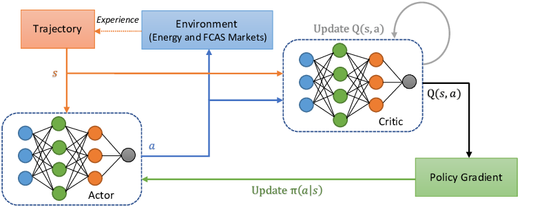
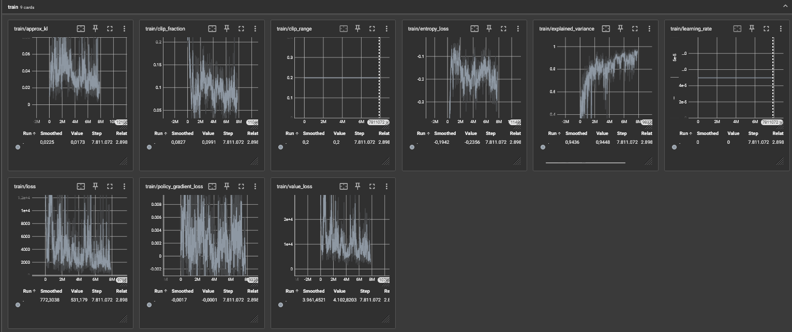

# Table of Contents

## Doom Reinforcement Learning

### About This Project
1. [Introduction](#introduction)
2. [Why PPO with CNN?](#why-ppo-with-cnn)
3. [Convolutional Neural Network (CNN)](#convolutional-neural-network-cnn)
4. [Proximal Policy Optimization (PPO)](#proximal-policy-optimization-ppo)
5. [The Setup](#the-setup)
6. [Gym and VizDoom Setup](#gym-and-vizdoom-setup)
7. [How to Train It?](#how-to-train-it)
8. [How to Test It?](#how-to-test-it)
9. [The Result](#the-result)
10. [Building ViZDoom from Source](#building-vizdoom-from-source)
    - [Dependencies](#dependencies)
        - [Linux](#linux)
            - [apt-based Distros (Ubuntu, Debian, Linux Mint, etc.)](#apt-based-distros-ubuntu-debian-linux-mint-etc)
    - [The Rest of the Dependencies](#the-rest-of-the-dependencies)


### Introduction 
This project was done for the class "17348 Machine Learning" and covers reinforcement learning using Proximal Policy Optimization (PPO) and a Convolutional Neural Network (CNN), also defined as a subset of machine learning. The CNN can also be classified as my ActorCriticPolicy.

### Why PPO with CNN?
Using PPO with CNN for training in Doom combines the strengths of both methods: CNNs are great at understanding the visual parts of the game, while PPO ensures that the learning process is stable and efficient, helping the agent to perform well in the game's complex and changing scenarios.

### What is Convolutional Neural Network (CNN)

A CNN is a type of deep neural network designed for analyzing visual data. It employs convolutional layers to automatically learn hierarchical representations of features within the input data.

### What is Proximal Policy Optimization (PPO)

PPO is a reinforcement learning algorithm that balances stability and sample efficiency by constraining policy updates. It achieves this through clipping policy gradients and employing an adaptive learning rate.

### The Setup
The network has been trained on is `deadly_corridor.wad`, but the config has been altered to the following:

```cfg
doom_scenario_path = deadly_corridor.wad

# Skill from 1 - 5. 5 being the hardest
doom_skill = 5

# Rewards
death_penalty = 100
living_reward = +1

# Rendering options
screen_resolution = RES_320X240
screen_format = CRCGCB
render_hud = true
render_crosshair = false
render_weapon = true
render_decals = false
render_particles = false
window_visible = true

episode_timeout = 2100

# Available buttons
available_buttons =
	{
		MOVE_LEFT
		MOVE_RIGHT
		ATTACK
		MOVE_FORWARD
		MOVE_BACKWARD
		TURN_LEFT
		TURN_RIGHT
	}

# Game variables that will be in the state
available_game_variables = { HEALTH DAMAGE_TAKEN HITCOUNT SELECTED_WEAPON_AMMO }

mode = PLAYER
```

Inside the `.wsd` file, a goal and internal reward are set. In this case, it will also receive rewards for going north with the armor being the primary goal. Now, to get there on level 5 skill, it needs to shoot and kill all the guards to get to the armor. If the skill level is set to 1, the actor will just run past the guards and win that way; the same strategy cannot be used here as the actor will die on its way to the goal.

As defined in the documentation in `stable_baselines3`, the network consists of 2 layers of 64 nodes each.

#### Gym and Vizdoom setup
The Gym Environment library provides basic methods like `step()`, `reset()`, `render()`, and `close()`, which are essential for interactions between an agent and its environment in reinforcement learning projects. These methods handle fundamental functionalities such as performing actions in the environment, resetting it, visualizing the process, and shutting it down (otherwise, they would just run in the background without any context).

In the case of VizDoom, the standard methods from the Gym Environment aren't directly applicable because they don't integrate well with VizDoom's system. Therefore, a custom implementation of these methods is required.


```python
from vizdoom import DoomGame 
from gym import Env
from gym.spaces import Discrete, Box
import cv2
import numpy as np

# Create Vizdoom OpenAI Gym Environment
class VizDoomGym(Env): 
    # Function that is called when we start the env
    
    def __init__(self, render=False, config=""): 
        super().__init__()  # Inherit from Env
        self.game = DoomGame()
        self.game.load_config(config)
        
        # Render frame logic
        if render is False: 
            self.game.set_window_visible(False)
        else:
            self.game.set_window_visible(True)
        
        self.game.init()  # Start the game 
        
        # Create the action space and observation space
        self.observation_space = Box(low=0, high=255, shape=(100,160,1), dtype=np.uint8) 
        self.action_space = Discrete(7)
        
        # Game variables: HEALTH DAMAGE_TAKEN HITCOUNT SELECTED_WEAPON_AMMO
        self.damage_taken = 0
        self.hitcount = 0
        self.ammo = 52
        
    # How to take a step in the environment
    def step(self, action):
        actions = np.identity(7)
        movement_reward = self.game.make_action(actions[action], 4) 
        reward = 0 
        
        if self.game.get_state(): 
            state = self.game.get_state().screen_buffer
            state = self.grayscale(state)
            
            # Reward shaping
            game_variables = self.game.get_state().game_variables
            health, damage_taken, hitcount, ammo = game_variables
            damage_taken_delta = -damage_taken + self.damage_taken
            self.damage_taken = damage_taken
            hitcount_delta = hitcount - self.hitcount
            self.hitcount = hitcount
            ammo_delta = ammo - self.ammo
            self.ammo = ammo
            
            reward = movement_reward + damage_taken_delta*10 + hitcount_delta*200  + ammo_delta*5 
            info = {"info": ammo}
        else: 
            state = np.zeros(self.observation_space.shape)
            info = {"info": 0}
        
        done = self.game.is_episode_finished()
        
        return state, reward, done, info 
    
    # Define how to render the game or environment
    def render(): 
        pass  # This is skipped due to vizdoom doing this for us
    
    # What happens when we start a new game 
    def reset(self): 
        self.game.new_episode()
        return self.game.get_state().screen_buffer
    
    # Close down the game
    def close(self): 
        self.game.close()
```
so when we then want to configure and run the model all we have to to is the following:

```python
    # Create the env and implementaion of env gym
    env = VizDoomGym(render=True, config=CONFIG)

    # Import an use the PPO algorithem and select actor & cretic policy
    model = PPO('CnnPolicy', env, tensorboard_log=LOG_DIR, verbose=1, learning_rate=0.00005, n_steps=2048)

    # 1. Set the amount of step the model should train with
    # 2. set how ofen the model should save
    # 3. Set where it should save
    model.learn(total_timesteps=10_000, callback=TrainAndLoggingCallback(check_freq=1000), save_path=CHECKPOINT_DIR)

```

For values not mentioned in the above PPO definition, this is the base values:

```python 
learning_rate: int = 3e-4,
n_steps: int = 2048,
batch_size: int = 64,
n_epochs: int = 10,
gamma: float = 0.99,
gae_lambda: float = 0.95,
clip_range: float = 0.2,
normalize_advantage: bool = True,
ent_coef: float = 0.0,
vf_coef: float = 0.5,
max_grad_norm: float = 0.5,
use_sde: bool = False,
sde_sample_freq: int = -1,
create_eval_env: bool = False,
verbose: int = 0,
device: str = "auto",
_init_setup_model: bool = True,
```

### How to Train It?

1. First, the environment (`VizDoomGym`) is initialized with `render=True` to visually display the game, and `config=CONFIG` specifies the configuration file to set up the game environment.
2. Next, a model is created using the PPO algorithm with a CNN-based policy (`CnnPolicy`). The model is configured to log to TensorBoard in `LOG_DIR`, with a set learning rate and a specific number of steps.
3. The training process begins with a specified number of timesteps (for example, `total_timesteps=10,000`). A `callback` function, `TrainAndLoggingCallback`, manages how often training status is logged and saved, in this example every 1000 steps. `save_path` specifies the path where training checkpoints are saved.

```python
# Create the environment and implementation of env gym
env = VizDoomGym(render=True, config=CONFIG)

# Import and use the PPO algorithm and select actor & critic policy
model = PPO('CnnPolicy', env, tensorboard_log=LOG_DIR, verbose=1, learning_rate=0.00005, n_steps=2048)

# 1. Set the amount of steps the model should train with
# 2. Set how often the model should save
# 3. Set where it should save
model.learn(total_timesteps=10_000, callback=TrainAndLoggingCallback(check_freq=1000), save_path=CHECKPOINT_DIR)
```

### How to Test It?
To test the agent, the `EvaluatePPO` class is instantiated with a `doomEnv`, the trained model, and a specified number of episodes. The evaluation function will then calculate and report the reward for each test episode and the average reward across all episodes.

```python
class EvaluatePPO:
    def __init__(self, doomEnv, model, number_of_episodes):
        # Load the trained model
        self.model = PPO.load(model)
        # Initialize the Doom environment
        self.env = doomEnv
        # Calculate average reward over a specified number of evaluation episodes
        self.mean_reward, _ = evaluate_policy(self.model, self.env, n_eval_episodes=10)
        self.ui = UserInterface()
        self.number_of_episodes = number_of_episodes
        
        # Start the evaluation process
        self.evaluate()

    def evaluate(self):
        episode_scores = []
        for episode in range(self.number_of_episodes):
            # Reset the environment for a new episode
            obs = self.env.reset()
            done = False
            total_reward = 0
            while not done:
                # Predict the action based on the observation
                action, _ = self.model.predict(obs)
                # Take the action and observe the new state, reward, and whether it's done
                obs, reward, done, info = self.env.step(action)
                # Accumulate the total reward
                total_reward += reward
                # Small delay for better visualization if necessary
                time.sleep(0.02)
            # Output the total reward for this episode
            print(f'Total Reward for episode {episode} is {total_reward}')
            episode_scores.append(total_reward)
            # Delay before the next episode for clarity
            time.sleep(2)

        # Display the average reward for all episodes
        self.ui.msg_confirm(f'Avg reward for episodes : {abs(sum(episode_scores)) / len(episode_scores)}')
```

### The Result


Using the explained configuration [The Setup](#the-setup), the actor will consistently start winning after 5-7 million steps. 

### A Quick Explanation of the Graph

- approx_kl: Approximate Kullback-Leibler divergence between old and new policy distributions.
- clip_fraction: Proportion of clipped policy gradients in PPO algorithm.
- clip_range: Maximum deviation allowed in PPO policy updates.
- entropy_loss: Measure of policy randomness in reinforcement learning.
- explained_variance: Proportion of target variance explained by predictions.
- learning_rate: Rate at which model parameters adjust during training.
- loss: Measure of discrepancy between predicted and actual values.
- policy_gradient_loss: Loss from updating policy in reinforcement learning.
- value_loss: Loss from updating value function in reinforcement learning.

## Building ViZDoom from Source

Here we describe how to build ViZDoom from source.
If you want to install pre-built ViZDoom wheels for Python, see [Python quick start](./pythonQuickstart.md).

### Dependencies

To build ViZDoom (regardless of the method), you need to install some dependencies on your system first.

#### Linux

To build ViZDoom on Linux, the following dependencies are required:
* CMake 3.12+
* Make
* GCC 6.0+
* Boost libraries 1.54.0+
* Python 3.7+ for Python binding (optional)

Also, some additional [ZDoom dependencies](http://zdoom.org/wiki/Compile_ZDoom_on_Linux) are needed.

##### apt-based Distros (Ubuntu, Debian, Linux Mint, etc.)

To get all dependencies on apt-based Linux (Ubuntu, Debian, Linux Mint, etc.), execute the following commands in the shell (might require root access).

```sh
# All possible ViZDoom dependencies,
# most are optional and required only to support alternative sound and music backends in the engine
# others can replace libraries that are included in the ViZDoom repository
apt install build-essential cmake git libsdl2-dev libboost-all-dev libopenal-dev \
zlib1g-dev libjpeg-dev tar libbz2-dev libgtk2.0-dev libfluidsynth-dev libgme-dev \
timidity libwildmidi-dev unzip

# Only essential ViZDoom dependencies
apt install build-essential cmake git libboost-all-dev libsdl2-dev libopenal-dev

# Python 3 dependencies (alternatively, Anaconda 3 installed)
apt install python3-dev python3-pip
# or install Anaconda 3 and

 add it to PATH
```

### The Rest of the Dependencies
You will need to install the following included in the file called `req.txt`. This includes the specific versions needed for the project to work. The `requirements.txt` does the same but includes all the dependencies for `req.txt`.