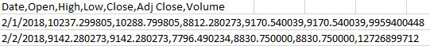
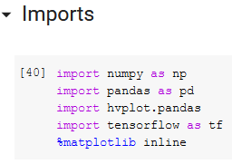
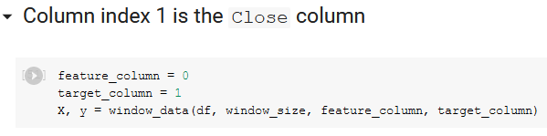
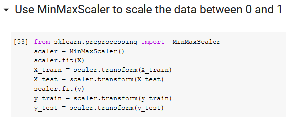
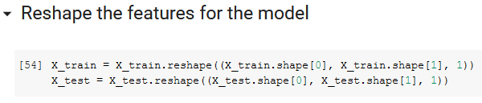
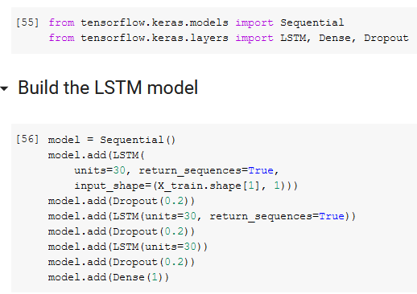
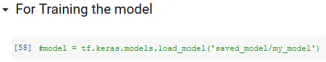
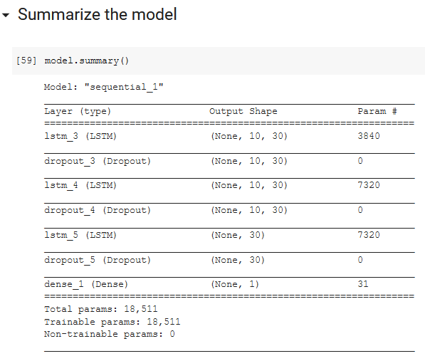
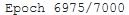
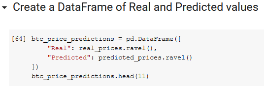

---
title: "Tensorflow stock prediction (Danish)"
description: "Reinforcement learning using Proximal Policy Optimization (PPO)."
pubDate: "Oct 1 2021"
heroImage: "https://github.com/mart337i/-Report-TensorFlow-Stock-Analysis/blob/main/readme_img/Aspose.Words.8a6b27ae-f232-43eb-b7e5-2490d0978c00.001.jpeg?raw=true"
tags: []
---

# TABLE OF CONTENTS
[Intrudoktion	3](#_toc73081287)

[værktøjer	3](#_toc73081288)

[imports	3](#_toc73081289)

[ekstensions	4](#_toc73081290)

[programmer	5](#_toc73081291)

[datasæt og hvad de indeholder	6](#_toc73081292)

[Brug af eksterne API’er	6](#_toc73081293)

[consept udredning (LSTM – Regration analyse – sentament analasys)	7](#_toc73081294)

[Long-short-term-memmory(LSTM)	7](#_toc73081295)

[Regration analyse	10](#_toc73081296)

[sentement analasys	11](#_toc73081297)

[algoritmisk handels model	11](#_toc73081298)

[kode dokomentation	12](#_toc73081299)

[resultater	19](#_toc73081300)

[refarencer	28](#_toc73081301)

## INTRODUKTION
Ideen bag Machine Learning ligger lidt i ordene, maskinen skal lærer og helst af sig selv og sine fejl, i stedet for at et menneske skal overvåge processen, for at sikrer at den lærer tingene rigtigt og med den rette forståelse af sammenhængen mellem input data og den ønskede output data, og så den ikke forsøger at huske ting, men at den lærer at forudse ting baserede på tidligere begivenheder.

Måden hvor på man sikrer at maskine lærer sig selv de rigtigt ting, er ved at give den dataset som gerne skal indeholde så meget data så muligt og den data skal være så præcis som muligt for at sikrer kvaliteten af AI modellen og at den kan forudse stabilt og præcist.

Vi har til dette projekt brugt 2 dataset for at forsøge på at øge præcisionen af de predictions som modellen skulle udregne, det ene dataset var et index over bitcoin for hver dag siden februar 2018.

Indexet indeholder dato, high price, low price, volume og closing price alt sammen for hver dag, det andet dataset var et fear, neutral og greed index, til at give modellen noget input på hvor mange der solgt, købte eller beholdt deres bitcoin for den specifikke dag.
## VÆRKTØJER
Vi har i opgaven Brugt flere forskelige værktøjer heraf Imports, ekstensions og programmer til at udføre opgeven. Disse værktøjer vil blive præsentert individuelt i denne section. Disse værktøjer er blevet valgt baseret på deres dokomentation , deres bruger venlighed og deres sammerbejder med andre værktøjer.
### IMPORTS

#### NUMPY
Vi bruger Numpy til multi- dimensionele objecter, bersal linær algabra og statiske opratioener.
det har også fordelen at Numpy arreys er ”fixed” og kræver den samme datatype, dette er både en fordel for memmory og ease of use idet det er namere at fejlfinde på. 
#### PANDAS
Vi bruger Pandas til at læse data’en fra vores datasæt, udeover dette bruger vi det også til at lave data frames. I billedet under præsenteres et eksempel på brugen af Panas iform af at tage dataen fra datasætet og modelen der der laver predictions og sætter dem op i en 2 dementionel rows og columns  structur, som der med den sidste linje code køre et check på data typen. ( Pandas bruger numpy arrey, så det er vigtigt det er samme datatype)

#### HVPLOTS
Denne import bruger vi sammen med Pandas til at tage vores 2 dementionele x og y og lave det til et visuelt 2 dementionelt kodinatsystem. Eksempel her under.

#### TENSORFLOW
Tenserflow er hjertet i opgaven idet det er vores machine-leraning engine, der håntere vores LSTM model, som er den model der træner vores træningsmodel.

Eksemplet under er ikke coden fra det givende project idet, det fylder for meget til at blive angivet til som et hurtigt eksempel, coden er fra den oficelle dokomentation for Tensorflow. 

### EKSTENSIONS
Vi har kun brugt jupyters Vscode Ekstention og en python auto complet.
### PROGRAMMER
#### JUPYTER 
jupyter er en open-source web application der giver muligheden for at dele og køre live kode, og visuelt statistisk matriale, udover dette er lavet til numerical simulation, statistical modeling, data visualization og machine learning.

Vi har hovdsagligt brugt det til at køre, fejlfinde og visueliser koden med jupyters værktøjer.   
#### WIREGUARD VPN
Vi har i denne opgave brugt en vpn forbindelse, idet det hele køre på en ekstern server.
der er ikke så meget at siger om programet udover det er utroligt brugervenligt
#### ANACONDA
Anaconda er vores packege maneger lavet til python 3.7 og python 2.7programmet kommer sågar pre instaleret med 50% af alle de pakker vi skal bruge,uuover dette virker den  også som vores startknap til jupyter. (eksempeler her under)

## DATASÆT OG HVAD DE INDEHOLDER
Vi bruger i denne opgaver 2 typer datasæt, BTC\_USD og BTC\_FNG. Disse 2 data sæt er rygradensen for vores Machine Learnning engine. Begge datasæt bliver brugt til at lave en prediction.
´BTC\_FNG eller Bitcoin – fear, neutral, greed bliver målt op mod BTC\_USD(Bitcoin – US $ doller) som indeholder al dataen omkring bitcoin (ekempel her under)

Bitcoin Fear – neutral – greed gæmmer på en dato og en FNG clasefication

Disse 2 datasæt bliver så målt opmod hinaden og hjælper vores ML til at komme med en prediticon

Datasætne bliver introduserede ved hjælp af vores import Panda der læser og bearbejder dataen(eksempel her under) 

 
## BRUG AF EKSTERNE API’ER
Vi startede projectet med et FNG datasæt fra en api, men det skabte problemmer med BTC\_USD datasættet og vi valgte derfor at skifte til et statisk datasæt. Det er ikke for at sige det ikke var en muglighed, det ville bare kræve en smule arbejde og tid, som vi fra prioriteret under productionsfasen.

## CONSEPT UDREDNING (LSTM – REGRATION ANALYSE – SENTAMENT ANALASYS)
### LONG-SHORT-TERM-MEMMORY(LSTM)
LSTM er er en kunstig tilbagevendende neuralt netværk (RNN) arkitektur, der anvendes inden for deep learning. I modsætning til standard feedforward neurale netværk har LSTM feedbackforbindelser. Det vil sige at den ikke kun behandler et enkelt datapunkt (såsom billeder), men også hele datasekvenser(så som vores datasæt).
#### RECURRENT NEURAL NETWORK (RNN)
For at for klare hvordan LSTM er, bliver vi nød til at gå tilbage til den bersale RNN og arbejde ud fra den.

Eksemplet over, er den bedste måde at visuelisere det på. Input bliver lavet til vector værdiger denne værdig vil som regl blive præsentert enten med en node som set i eksemplet over eller med [X1,X2]. 
disse tal bliver så kørt målt op mod en data matrix, og der bliver derefter givet et output. Dette output bliver nu sat ind som input og sekvensen køre igen. et mere komplext eksempel er således: du har den perfecte roommate, han laver 3 forskellige typer mad, en betingelse; vejret. Vejret bestemmer nemlig hvad han laver dagen efter. Visuelt ser det sådan ud:

Disse 2 typer vector værdiger kan også ses med en vector matrix, som set i billdet under: 

Der bliver så valgt en vector værdig som bliver sat ind i vores node / vector denne værdig går så vidre til anden række noder, hvor de derefter bliver lagt sammen og kørt igennem en non-linær funktion som tager det højste tal og laver det om til et 1 og alt andet om til 0, efter funktion er kørt samler den resutalterne consponderende med pilen. Hvorefter den tager  outputet og smider in som input igen, og det er sådan vi udregner hvilken mad vores perfecte roomate laver i forhold til vejret dagen efter.

RNN er bygge blokken til vores LSTM arkitektur og er derfor vigtigt at forstå, for at kunne se hvad der sker i vores LSTM.
#### LSTM
Long-short-term-memory er vores lærings function, som arbejder med to fundemantale funktioner som er Tanh fucktion og hidden state. Disse to ligger det funtemantale grundlag for funktioen.

Hiden state er vores input samt vores output når inputet er kørt i gennem tanh funktionen.
Tanh-funktionen, også kaldet hyperbolsk tangensfunktion, er en omskalering af det logistiske sigmoid, således at dets output spænder fra -1 til 1. (Der er også vandret strækning.) funktioen matematiske beregnelse ser sådan ud (eksempel under.)

tanh(x)=2g(2x)-1

outputet er praktisk for neurale netværk i det at outputet ligger mellem (-1 og 1). De to funktioner er afbildet nedenfor. Blå er sigmoids logistiske funktion (gx=ex1+ex), og rød er tanh. Jeg kommer mere ind på sigmoids logistiske funktion senere idet det også er en central del i vores LSTM arkitektur.

Grunden til at det er vigtigt at outputet ligger mellem -1 og 1 er at vis vores input ligger mellem -1 og 0.5 bliver det skåret fra og alt over 0,5 til 1 bliver ført vidre til næste fase. Output bliver så kørt igennem samme funktioen igen. det er den simple teori bundet til Short-term-memory idet den endnu ikke kan huske særlig meget. Det er her hvor den mere complexe model kommer i spil, det er også her vi skal kigge på sigmoids logistiske funktion da den kommer på spil her. sigmoids logistiske funktion er en matematisk formel brugt i ML og genrelle statisiske funktioner, formlen ser således ud;

gx=ex1+ex

Billedet her under er den komplete LSTM model og kræver nok lige en forklaring, de 3 røde cirkler præsentere sigmoids logistiske funktion  og de 2 blå præsentere vores Tahn funktion.

Billedet er bedst forklaret med en række billeder med tilsvarende text. Idet der er mange viabler igang på sammetid.

Billedet her over er billede 1 og her bliver ht-1og x1præsenteret. ht-1 er vores hiden state(input), grunden til at der står -1 under ”h” er fordi det på nuværende tidspunk bliver set som gammel data

Billede 2 præsentere udregnignen for når ht-1og x1bliver kørt igennem de 2 sigmoids logistiske funktioner og den ene Tahn funktion disse uregninger er nu præsenterede med ft,itog c"t

Billede 3 her stilles ct=ft\*ct-1+it\*c¨t derefter stiles den uregnede new cellstate ud og ganges med vores orginale når ht-1og x1 dette efterlader new cellstate[ct] og hiden state[h1] som vores output. Hele systemet kan også beskrives i kode[python] og det ville se således ud: 

### REGRATION ANALYSE

Vi blive meget ofte nød til at tænke på hvad for et problem vi sidder med når vi snakker Machine leraning, om det er et classifaction eller regrations problem vi sidder med. Vi sidder så i den position at vi står med begge problemstillinger. Vi bruger clasification både med vores FNG datasæt og i vores centrale LSTM model, og så bruger vi regration til vores BTC\_datasæt.
### SENTEMENT ANALASYS
Vi har gjort bruge af en manuel metode til at indhente vores sentement analasys, for at kunne kontrollere data bedre, sådan at der ikke kommer fejl data eller at dataen bliver fejl behandlet.

Det data vi har indhentet, er vores fear, neutral og greed index, som er data indsamlet for at kunne se hvordan marked for bitcoin (i dette tilfælde) opfører sig på en givet dag i forhold til om der er mange der gerne vil køb (Greed), sælg (Fear) eller beholde (Neutral).

Dette index giver vores model en meget bedre ide om hvordan den kan forudse pris ændringer, da den har det ekstra lag af information.
## ALGORITMISK HANDELS MODEL

vi vil meget kort snakke om algoritmisk handels og den exsitens i verden.

Algoritmisk handel involverer brugen af ​​komplekse AI-systemer til at tage ekstremt hurtige handelsbeslutninger. (opstod i 70'erne)

Algoritmiske systemer foretager ofte tusinder eller millioner af handler på en dag, deraf udtrykket "højfrekvent handel" (HFT), der betragtes som en delmængde af algoritmisk handel.

De fleste hedgefonde og finansielle institutioner afslører ikke åbent deres AI-tilgange til handel (med god grund), men maskinlæring og dyb læring spiller en stadig vigtigere rolle i kalibrering af handels-beslutninger i realtime.

Aktiemarkedet bevæger sig som reaktion på utallige menneskelige relaterede faktorer, og håbet er, at maskinindlæring vil være i stand til at replikere og forbedre menneskelig "intuition" af økonomisk aktivitet ved at opdage nye tendenser og signaler

Nogle populære hedgefonde, der bruger AI, inkluderer - Two Sigma, LLC, PDT Partners, DE Shaw, Man AHL, Citadel, Vatic Labs, Point72, Cubist etc.

Sentient Technologies, et AI-selskab med base i San Francisco, der også driver en hedgefond, har udviklet en algoritme, der indtager millioner af datapunkter for at finde handelsmønstre og prognose-tendenser, der gør det muligt at træffe vellykkede beslutninger om aktiehandel.

Sentient kører billioner af simulerede handelsscenarier oprettet ud fra de store mængder offentlige data, der er tilgængelige online. 1.350 dages handel ned på et par minutter.

Succesfulde handelsstrategier, som det kalder "gener", testes derefter i livehandel, hvor de udvikler sig autonomt, efterhånden som de får erfaring.

Numerai bruger kunstig intelligens til at træffe handelsbeslutninger.

I stedet for selv at udvikle algoritmerne har de outsourcet opgaven til tusindvis af anonyme dataforskere, der konkurrerer om at skabe de bedste algoritmer og vinde kryptokurrency for deres indsats.

De deler handelsdata med forskerne på en måde, der forhindrer dem i at replikere fondens handler, mens de giver dem mulighed for at opbygge modeller til bedre handler.
## KODE DOKOMENTATION
Imports, er basically bare plugins til at bruge forskellige metoder til at behandle data inputs, eller flytte data inputs til tabeller for at modellen kan bruge input dataen.

Her indlæses fear, neutral and greed dataset.

Her indlæser vi igen FNG (fear, neutral and greed) dataset og derefter fjern vi en kolonne ”fng\_classification”, da vi ikke skal bruge den til modellen.

Her indlæser vi bitcoin priserne for de sidste 2-3 år og udtager så 2 typer data fra datasetet, den ene er dato og den anden er ”close” prisen eller sagt på dansk, så er det den sidste pris på den dag som regler prisen kl 23:59.

Derefter samler vi dataen fra begge dataset ind i et samlet dataset. Så vi har en dato, en FNG-værdi (fear, neutral and greed) og en ”close” pris.

Her behandler vi data fra det samlet dataset så at det er klar til at modellen kan indlæse det rigtigt.

Her kan vi vælge hvor mange dage vi vil have at vores model skal bruge for at lave dens prediction. Så hvis denne er sat til 5 (som vores er), bruger den 5 dages data til at forudse den 6. dag.

Her informerer vi vores model om hvilken data feature eller target. (om det er input data eller om det er den forventede output data.)

Her indstiller vi hvor meget af data vi vil bruge til træning af modellen og hvor meget af dataen vi vil bruge til testning.

Her behandler vi igen det samlet dataset for at fortælle modellen hvilken data er feature og target.

I toppen har vi igen lidt plugins denne gang er det til at lave en LSTM model. Dette er ”starten” på vores model, forstået på den måde at vi her oprette en model der er indstillet til at behandle vores dataset, men den har endnu ikke prøvet at kører, så den har ikke lært noget. 

Derefter compile vi model så den er klar til at kører for første gang. (Dette samler bare alle indstillinger vi har sat tidligere i koden, ind i modellen så den er klar til at kører)

Denne del af koden skal vi ikke bruge første gang at vi kører modellen, men den skal være der efter første gang for at kunne indlæse hvad den har lært før. (Det er modellens læring i file form)

Dette er en oversigt over de forskellige layers og dropouts som modellen bruger under træning af datasets.

Her starter vi træningen af selve modellen, X\_train og Y\_train er dataen. Epcohs er gentagelser eller hvor mange gange den skal prøve at gætte en værdi. Shuffle er om du vil have at dataen skal indlæse ”random” eller fra top til bund. Batch\_size er hvor meget af dataen den skal læse nå den prøver at gætte en værdi, om det skal være hele datasetet eller om det kun skal være en lille sektion af dataen. Verbose er bare den grafiske feedback imens den træner, verbose = 1 giver mest information, hvor verbose = 5 kun fortæller hvilken epoch der pt er i gang (Så mindst information muligt).

Verbose = 1:

Verbose = 5:

Her få vi et lille indblik i hvordan modellen i gennemsnittet håndterede alle de epochs den har kørt. 

Her beder vi modellen om at give dens predictions i fra den træning den lige har kørt.

Her beder vi modellen om at genskabe de originale bitcoin priser, så vi kan sammenligne vores predictions med den rigtige pris. 

Her ligger vi vores predictions og de rigtige bitcoin ind i en data frame så vi kan få et bedre overblik af selve tallene fra dataen, men også fordi at det gør at vi kan få en graf af vores data.

Dette er data framen.

Og her beder vi modellen om at udskrive vores graf

## RESULTATER
Vi har selvfølig nogen reultater fra vores opgave dem vil vi meget gerne vi jer.
modelen er sat op med følgende konfirguration

- 7000 epochs 
- shuffle = non
- Batch size 30.
- verbose 1

Model 1 

Model 2 

Model 3 

Model 4

Model 5

Model 6

Model 7

Model 8

Model 9

Model 10

Model 11

Model 12

Model 13

Model 14

Model 15

Model 16

## REFARENCER
- Sairen - OpenAI Gym Reinforcement Learning Environment for the Stock Market
  - <https://doctorj.gitlab.io/sairen/>
- Tensorflow for beginners
  - <https://www.tensorflow.org/tutorials/quickstart/beginner>
- Cryptocurrency Price Prediction Using Deep Learning
  - <https://trello.com/c/TGn2hkfN/10-cryptocurrency-price-prediction-using-deep-learning>
- Market Prediction
  - <https://github.com/llSourcell/AI_in_Finance/blob/master/Market%20Prediction.ipynb>

Gruppe : Egeskov og Rune 		Opgave:SKP-selv-vaglt-opgave

Start på projectet: 17 – 5 – 2021		aflevering dato: 28 – 5 – 2021
